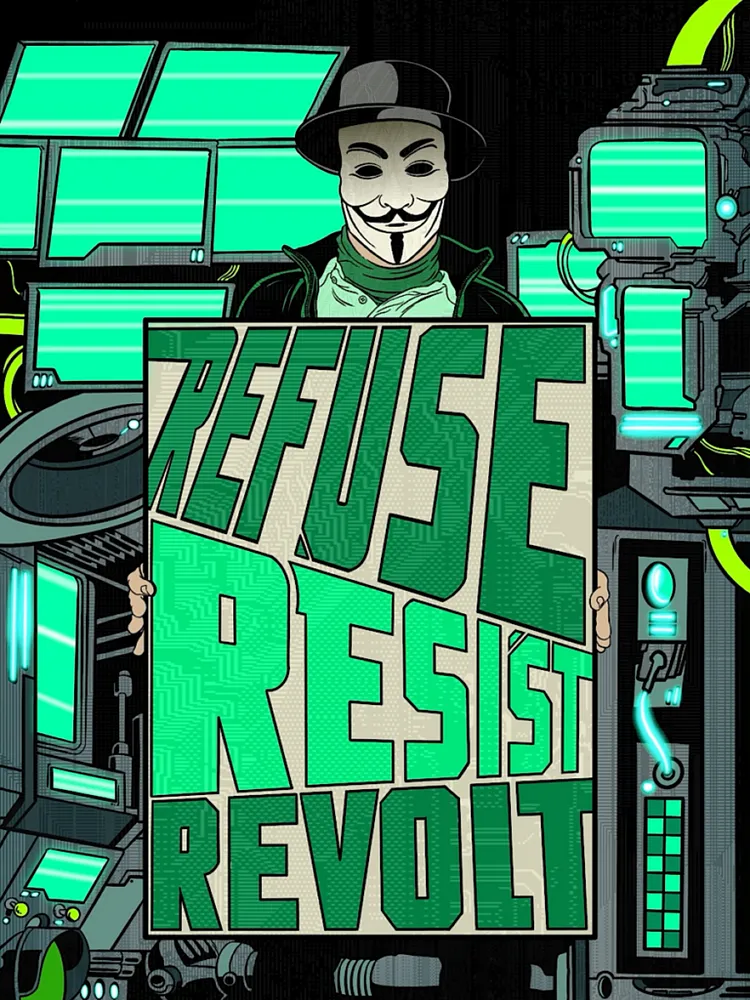

<p align="center">【ＭＡＴＲＩＸ　ＥＮＴＲＹ】</p>

```
___.                .__                   ___________  ____            __  .__     
\_ |______________  |  |__   _____ _____ /_   \   _  \/_   |     _____/  |_|  |__  
 | __ \_  __ \__  \ |  |  \ /     \\__  \ |   /  /_\  \|   |   _/ __ \   __\  |  \ 
 | \_\ \  | \// __ \|   Y  \  Y Y  \/ __ \|   \  \_/   \   |   \  ___/|  | |   Y  \
 |___  /__|  (____  /___|  /__|_|  (____  /___|\_____  /___| /\ \___  >__| |___|  /
     \/           \/     \/      \/     \/           \/      \/     \/          \/ 
```


<div align="center">
 
</div>
<br/>

<p align="center">
<strong>Brahma101.eth</strong> • <em>paradigm shifter hacking the matrix</em>
</p>

<p align="center">
<code>// Privacy advocate • Self-custody evangelist • Data sovereignty architect</code><br/>
<code>// Building tools for digital freedom and economic sovereignty</code><br/>
<code>// Decentralizing power through code and cryptography</code>
</p>

<br/>
<p align="center">【ＣＯＮＮＥＣＴ】</p>
<p align="center">
 <a href="https://twitter.com/brahma101_eth"></a>
 <a href="https://brahma101.cyou"></a>
 <a href="https://brahma101.eth.limo/"></a>
</p>
<br/>

<p align="center">【ＥＸＰＥＲＩＭＥＮＴＳ】</p>

<div align="center">
<br/>
<a href="https://github.com/gerryalvrz/generative-art"></a>
<a href="https://github.com/gerryalvrz/web3-tools"></a>
<a href="https://github.com/gerryalvrz/privacy-tools"></a>
<br/>
<a href="https://github.com/gerryalvrz/self-custody"></a>
<a href="https://github.com/gerryalvrz/decentralized-storage"></a>
<a href="https://github.com/gerryalvrz/censorship-resistance"></a>
</div>

<div>
 <p align="center">【ＴＥＣＨ　ＳＴＡＣＫ】</p>
<br/>
 <p align="center">
        
        
        
        
        
        <br/>
        
        
        
        
        
</p>
</div>

<div>
        <p align="center">
        <b>【ＣＲＥＡＴＩＶＥ　ＥＸＰＬＯＲＡＴＩＯＮＳ】</b>
        </p> 
        <p align="center">
        <code>// Generative Art Experiments</code><br/> 
        <code>// Interactive Web3 Experiences</code><br/>
        <code>// Psychedelic Digital Landscapes</code><br/>
        <code>// Matrix-style Visualizations</code><br/>
        <code>// Creative Coding Adventures</code>
        </p>
</div>


<br/>


<p align="center">【ＣＯＤＥ　ＳＴＡＴＳ】</p>
<div id="header" align="center">
<a href="https://github.com/anuraghazra/github-readme-stats">
  
</a>
</div>

<div align="center">
<code>// Matrix connection established</code><br/>
<code>// Reality.exe running smoothly</code><br/>
<code>// Consciousness synchronized with code</code>
</div>

<div align="center">
  
</div>

```
        _     _ __   _ _______  ______  _____  _     _ __   _ _     _
 |      |     | | \  | |_____| |_____/ |_____] |     | | \  | |____/ 
 |_____ |_____| |  \_| |     | |    \_ |       |_____| |  \_| |    \_
                                                                     
```


